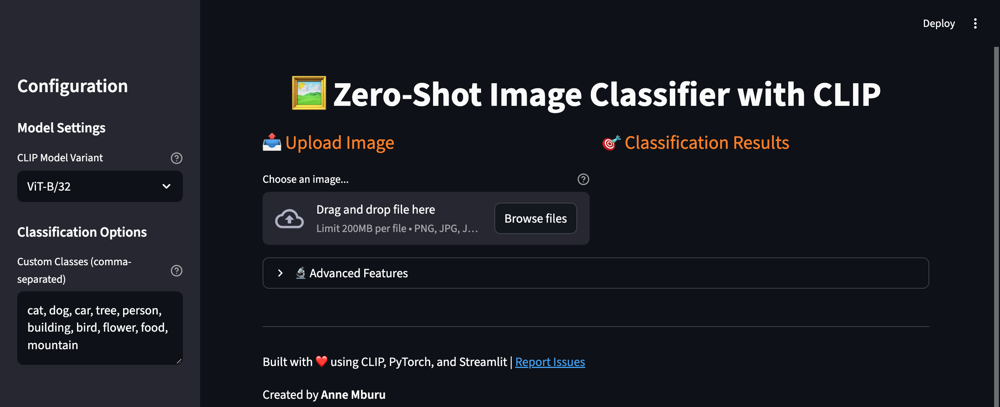
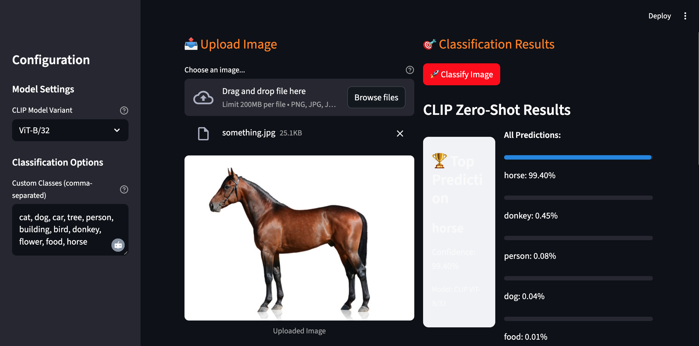
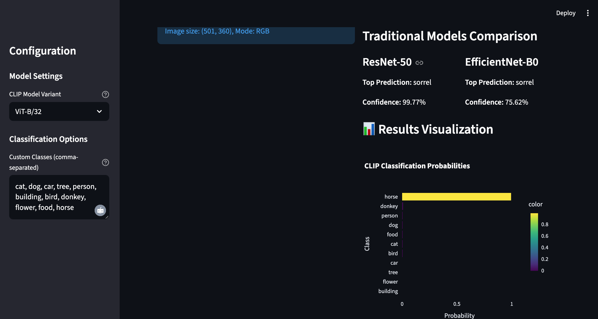

# Zero-Shot Image Classification with CLIP

## 📌 Project Overview  
A powerful web application that classifies images using OpenAI's CLIP model without any training required. Compare zero-shot capabilities with traditional models like ResNet and EfficientNet.

## ✨ Features
- **Zero-Shot Classification**: Classify images into custom categories without training
- **Multiple CLIP Models**: Support for various CLIP architectures (ViT-B/32, ViT-B/16, RN50)
- **Traditional Model Comparison**: Compare with ResNet-50 and EfficientNet-B0
- **Interactive Web Interface**: Built with Streamlit for easy use
- **Visual Results**: Beautiful visualizations with Plotly
- **Few-Shot Learning Demo**: Conceptual demonstration of few-shot capabilities

## ⚙️ Installation and Setup  

### 1. Clone the repository
```bash
git clone https://github.com/anniemburu/Zero-Shot-Image-Classifier-with-CLIP
```

### 2. Create and activate a virtual environment (Recommend Anaconda or miniconda)
```bash
conda create -n myenv python=3.11

conda activate myenv
```

### 3. Install dependencies

All dependencies are listed in requirements.txt. Install them with:

```bash
pip install -r requirements.txt
```

### 4. Data setup

Zero-Shot classification doesn't need training data. You can save the images you want to test in:
```bash assets/example_images/```. 

## 🚀 Running the App 

Run the training pipeline with:

```bash
streamlit run app.py 
```

## 🚀 Using Few-Shot Leaning
The app give you the capability of also trying few shot leaning and compare how well they perform on your dataset. 


## 📂 Project Structure

```bash
├── app.py
├── assets/
│   ├── example_images/
│   │   └── #save your data here
├── utils/
│   ├── __init__.py
│   ├── clip_classifier.py
│   └── traditional_modeels.py               
├── requirements.txt
└── README.md

```

## 🔎 Snip of the App
### Landing Page


### Classification Result




